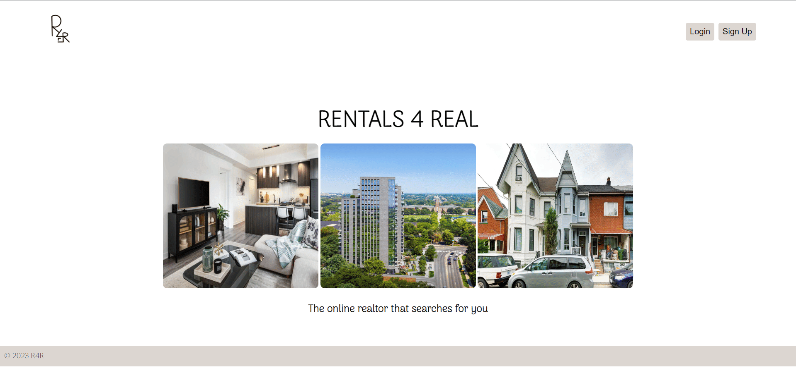
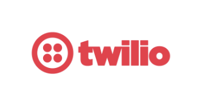

<h1 align="center">
  <br>
  <a href="https://r4r.tech/"></a>
  <br>
  Rentals 4 Real
  <br>
</h1>

<h4 align="center"> <br>The realtor that searches for you. </h4>

<p align="center">
  <br>
  <a href="#introducing-r4r">Introduction</a> •
  <a href="#myrole">My Role: UX/UI Design</a> •
  <a href="#inspiration">Inspiration</a> •
  <a href="#key-features">Key Features</a> •
  <a href="#how-to-use">How To Use</a> •
  <a href="#credits">Credits</a> •
  <a href="#sponsors">Sponsors</a> •
</p>



## Introducing R4R

Rentals 4 Real is a platform that automates the housing rental search process.

## My Role: UX/UI Design

[Here]([https://www.google.com](https://www.figma.com/file/3iS4q3rLpHEudUNikr02sF/deerhacks---real4real?type=design&node-id=0%3A1&t=XeVKSujHyHpCbL5Q-1)) is the Figma file.


My role as part of the team working on the front-end of the project, was to design and build the foundation of the website's structure and layout. I used Figma to create a basic mock-up design to then be coded using HTML, JS and CSS. Furthermore, the README, submission video and logo were all created by me.

## Inspiration

We were inspired to create R4R based off our personal experiences and frustrations while searching for off-campus housing as university students. 

[Demo Video](https://youtu.be/XS3K1xTzPAk)

## Key Features

* Live SMS Alerts - Real time house hunting 
  - Get SMS alerts for properties that you have saved, so you are always on top of the house search!
* Smart recommendations - Find your dream home
  - Our smart recommendation system will find you the best properties based on your preferences.
  - You can also filter by price, location, and more!
  - Save your favourite properties to view later.
* Easy to use UI
  - Our simple and intuitive UI makes it easy to find your dream home.
* Automatic property updates
  - Our database is updated daily, so you will always have the latest listings and alert you when a new one is posted.


## How To Use
### Requirements to Run
- Python 3.10.X
- Pip
### Running the Program
```shell
# setting up requirements
pip install -r requirements.txt
# setting environment variables
export RentProjectMongo=<your mongo uri>
# running the program
uvicorn main:app
```

## How It Works

We are using FastAPI's web framework to create a REST API. The API is connected to a MongoDB database, which stores all the data. The API is hosted on Heroku, and the database is hosted on MongoDB Atlas. The frontend is built using React, and is hosted on Netlify. The frontend is connected to the API using the native fetch API.

### Rest API
For the complete API documentation please visit [here](https://r4r.tech/docs)


## Sponsors

We would like to extend our gratitude to the sponsors of Deerhacks 2023, for supporting us in bringing this project back to life.

<a href="https://www.twilio.com/"></a>

<a href="https://www.domain.com/mlh"></a>

<a href="https://mlh.io/"></a>


## Credits

This website uses the following packages:
- Python - [Python](https://www.python.org/)
- FastAPI - [FastAPI](https://fastapi.tiangolo.com/)
- MongoDB - [MongoDB](https://www.mongodb.com/)
- Node.js - [Node.js](https://nodejs.org/en/)
- express - [express](https://expressjs.com/)
- bootstrap - [bootstrap](https://getbootstrap.com/)


## Team

<table>
  <tr>
    <td align="center">
    <a href="https://github.com/usha-sj"><br /><sub><b>Usha Sophea Janardhan</b></sub></a><br /></td>
    <td align="center">
    <a href="https://github.com/nitic04"><br /><sub><b>Niti Chaudhary</b></sub></a><br /></td>
    <td align="center">
    <a href="https://github.com/ggggg"><br /><sub><b>Ido Ben Haim</b></sub></a><br /></td>
    <td align="center">
    <a href="https://github.com/jman005"><br /><sub><b>Justin Young</b></sub></a><br /></td>
  </tr>
</table>
